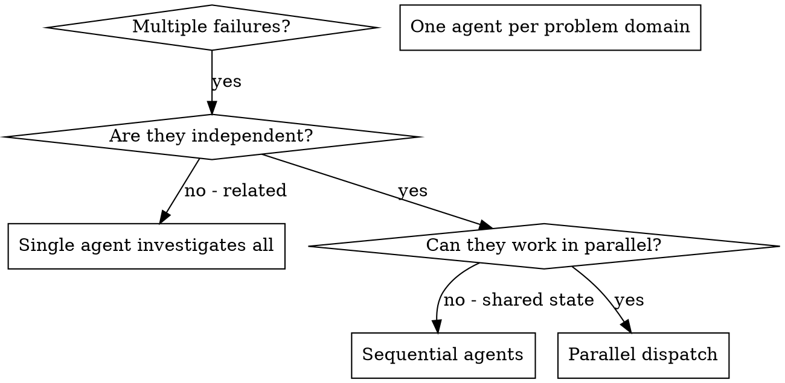

# Dispatching Parallel Agents

## Overview

When you have multiple unrelated failures (different test files, different subsystems, different bugs), investigating them sequentially wastes time. Each investigation is independent and can happen in parallel.

**Core principle:** Dispatch one agent per independent problem domain. Let them work concurrently.

## When to Use



**Use when:**
- 3+ test files failing with different root causes
- Multiple subsystems broken independently
- Each problem can be understood without context from others
- No shared state between investigations

**Don't use when:**
- Failures are related (fix one might fix others)
- Need to understand full system state
- Agents would interfere with each other

## The Pattern

### 1. Identify Independent Tickets

Use `tk ready` to find tickets with resolved dependencies:

```bash
tk ready
# Shows: ticket-abc (Fix abort tests), ticket-def (Fix batch tests), ticket-ghi (Fix race conditions)
```

If tickets don't exist yet, create them:

```bash
tk create "Fix agent-tool-abort.test.ts failures" --type=bug
tk create "Fix batch-completion-behavior.test.ts failures" --type=bug
tk create "Fix tool-approval-race-conditions.test.ts failures" --type=bug
```

Each ticket is independent - fixing abort tests doesn't affect race condition tests.

### 2. Start Tickets Before Dispatch

Mark all tickets as in-progress before dispatching agents:

```bash
tk start <ticket-abc>
tk start <ticket-def>
tk start <ticket-ghi>
```

### 3. Dispatch Agents in Parallel

Each agent gets a ticket ID and works on that scope:

```typescript
// All three run concurrently
Task("Fix ticket <ticket-abc>: agent-tool-abort.test.ts failures")
Task("Fix ticket <ticket-def>: batch-completion-behavior.test.ts failures")
Task("Fix ticket <ticket-ghi>: tool-approval-race-conditions.test.ts failures")
```

### 4. Review, Close, and Integrate

When agents return:
- Read each summary
- Verify fixes don't conflict
- Run full test suite
- Close tickets with notes:

```bash
tk add-note <ticket-abc> "Root cause: timing issues. Fixed with event-based waiting."
tk close <ticket-abc>

tk add-note <ticket-def> "Root cause: threadId in wrong place. Fixed event structure."
tk close <ticket-def>

tk add-note <ticket-ghi> "Root cause: async not awaited. Added proper wait."
tk close <ticket-ghi>
```

## Agent Prompt Structure

Good agent prompts are:
1. **Focused** - One ticket, one problem domain
2. **Self-contained** - Ticket ID + context needed to understand the problem
3. **Specific about output** - What should the agent return?

```markdown
Work on ticket <ticket-abc>: Fix agent-tool-abort.test.ts failures

Run `tk show <ticket-abc>` for full details.

3 failing tests:
1. "should abort tool with partial output capture" - expects 'interrupted at' in message
2. "should handle mixed completed and aborted tools" - fast tool aborted instead of completed
3. "should properly track pendingToolCount" - expects 3 results but gets 0

These are timing/race condition issues. Your task:

1. Read the test file and understand what each test verifies
2. Identify root cause - timing issues or actual bugs?
3. Fix by:
   - Replacing arbitrary timeouts with event-based waiting
   - Fixing bugs in abort implementation if found
   - Adjusting test expectations if testing changed behavior

Do NOT just increase timeouts - find the real issue.

Return: Summary of root cause and fix. I will close the ticket with your notes.
```

## Common Mistakes

**❌ Too broad:** "Fix all the tests" - agent gets lost
**✅ Specific:** "Fix agent-tool-abort.test.ts" - focused scope

**❌ No context:** "Fix the race condition" - agent doesn't know where
**✅ Context:** Paste the error messages and test names

**❌ No constraints:** Agent might refactor everything
**✅ Constraints:** "Do NOT change production code" or "Fix tests only"

**❌ Vague output:** "Fix it" - you don't know what changed
**✅ Specific:** "Return summary of root cause and changes"

## When NOT to Use

**Related failures:** Fixing one might fix others - investigate together first
**Need full context:** Understanding requires seeing entire system
**Exploratory debugging:** You don't know what's broken yet
**Shared state:** Agents would interfere (editing same files, using same resources)

## Real Example from Session

**Scenario:** 6 test failures across 3 files after major refactoring

**Failures:**
- agent-tool-abort.test.ts: 3 failures (timing issues)
- batch-completion-behavior.test.ts: 2 failures (tools not executing)
- tool-approval-race-conditions.test.ts: 1 failure (execution count = 0)

**Decision:** Independent domains - abort logic separate from batch completion separate from race conditions

**Create tickets:**
```bash
tk create "Fix agent-tool-abort.test.ts: 3 timing failures" --type=bug    # → nw-abc
tk create "Fix batch-completion-behavior.test.ts: 2 failures" --type=bug  # → nw-def
tk create "Fix tool-approval-race-conditions.test.ts: 1 failure" --type=bug  # → nw-ghi
tk start nw-abc && tk start nw-def && tk start nw-ghi
```

**Dispatch:**
```
Agent 1 → Work on ticket nw-abc
Agent 2 → Work on ticket nw-def
Agent 3 → Work on ticket nw-ghi
```

**Results:**
- Agent 1: Replaced timeouts with event-based waiting
- Agent 2: Fixed event structure bug (threadId in wrong place)
- Agent 3: Added wait for async tool execution to complete

**Close tickets:**
```bash
tk add-note nw-abc "Replaced arbitrary timeouts with event-based waiting"
tk close nw-abc
tk add-note nw-def "Fixed threadId placement in event structure"
tk close nw-def
tk add-note nw-ghi "Added await for async tool execution"
tk close nw-ghi
```

**Integration:** All fixes independent, no conflicts, full suite green

**Time saved:** 3 problems solved in parallel vs sequentially

## Key Benefits

1. **Parallelization** - Multiple investigations happen simultaneously
2. **Focus** - Each agent has narrow scope, less context to track
3. **Independence** - Agents don't interfere with each other
4. **Speed** - 3 problems solved in time of 1

## Verification

After agents return:
1. **Review each summary** - Understand what changed
2. **Check for conflicts** - Did agents edit same code?
3. **Run full suite** - Verify all fixes work together
4. **Spot check** - Agents can make systematic errors
5. **Close tickets** - Add notes with root cause and fix summary

```bash
tk ls --status=in_progress  # Should show the tickets agents worked on
# For each completed ticket:
tk add-note <id> "<agent's summary>"
tk close <id>
```

## Real-World Impact

From debugging session (2025-10-03):
- 6 failures across 3 files → 3 tickets created
- 3 agents dispatched in parallel (one per ticket)
- All investigations completed concurrently
- All fixes integrated successfully
- Zero conflicts between agent changes
- All 3 tickets closed with documented root causes
